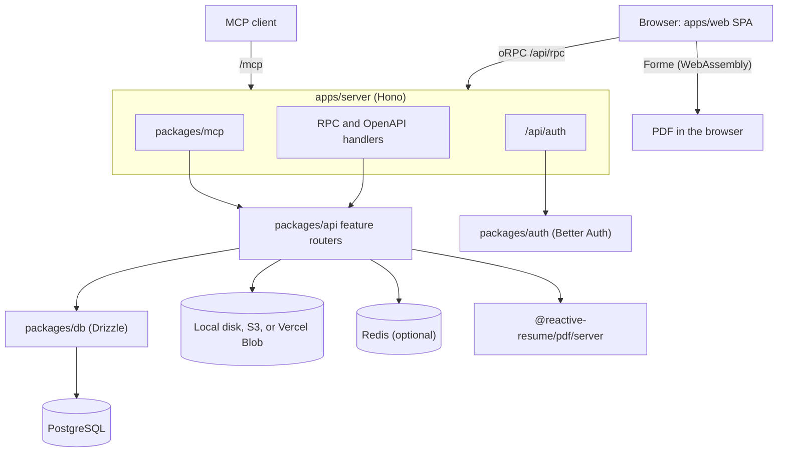

Reactive Resume is a TypeScript monorepo managed with pnpm workspaces and Turborepo. This page explains how the pieces fit together, so you can find the code behind a feature and know where a change belongs. To get a working checkout first, see [Development setup](/contributing/development).

## The big picture

There are two apps and a set of shared packages:

- **`apps/web`** is a client-rendered React 19 single-page app built with Vite, TanStack Router, TanStack Query, Tailwind CSS, and Lingui for translations.
- **`apps/server`** is a Hono application on Node.js. It serves the API, authentication, the MCP server, uploads, OpenAPI, and the built web app.
- **`packages/*`** hold everything the apps share: API business logic, authentication, database access, schemas, PDF and DOCX rendering, and UI primitives.

The browser talks to the server through [oRPC](https://orpc.unnoq.com/) at `/api/rpc`. [Better Auth](https://www.better-auth.com/) handles sign-in, sessions, passkeys, two-factor authentication, API keys, and the OAuth provider used by MCP clients. [Drizzle](https://orm.drizzle.team/) talks to PostgreSQL.

### How it runs

- **Development.** `pnpm dev` starts Vite on `PORT` (default `3000`), the Hono server on `SERVER_PORT` (default `3001`), and the email template preview on port `3002`. Vite proxies `/api`, `/mcp`, `/uploads`, `/.well-known`, and `/schema.json` to Hono, so you always open `http://localhost:3000`.
- **Docker.** The production image runs one Node.js process on port `3000`. Hono mounts the API, auth, MCP, and static routes, then serves the built web app.
- **Vercel.** One project deploys two services: `frontend` serves the static web build from the CDN, and `backend` runs the same Hono app in a Node.js Function. See [Deployment checks](/contributing/deployment-checks).

There is no request-time React server rendering. The web build prerenders the marketing homepage for each locale, and `apps/server/src/static/web.ts` serves HTML shells with OpenGraph, canonical, and JSON-LD metadata injected.

### What happens at startup

The server checks the environment, applies database migrations, and verifies the migrated schema before it initializes auth and accepts traffic. With `STRICT_SCHEMA_CHECK=true`, schema drift stops the server; otherwise it logs the drift and continues.

## Workspace map

| Workspace             | What it owns                                                                                                                                          |
| --------------------- | ----------------------------------------------------------------------------------------------------------------------------------------------------- |
| `apps/web`            | Routes (`src/routes`, file-based), user-facing features (`src/features`), the PDF.js preview and public viewer, the PWA, and the oRPC browser client  |
| `apps/server`         | Hono route composition (`src/http`), RPC and OpenAPI adapters, the MCP transport, static and upload handlers, SEO for HTML shells, and startup checks |
| `packages/api`        | oRPC procedures and business logic, one folder per feature under `src/features/*`                                                                     |
| `packages/auth`       | Better Auth configuration, helpers, and types                                                                                                         |
| `packages/db`         | Drizzle client and schema; generated migrations live in the root `migrations/` folder                                                                 |
| `packages/env`        | Server environment validation; loads the root `.env`                                                                                                  |
| `packages/schema`     | Zod schemas for resumes, pages, and templates                                                                                                         |
| `packages/resume`     | Pure resume logic with no database, HTTP, or DOM dependencies, such as JSON Patch helpers and social network icons                                    |
| `packages/pdf`        | Resume templates, the Forme adapter, font resolution, custom-style support, and browser and server PDF adapters                                       |
| `packages/docx`       | DOCX export                                                                                                                                           |
| `packages/mcp`        | MCP tools, prompts, resources, and the server card                                                                                                    |
| `packages/ai`         | AI provider types, prompts, and model-facing helpers                                                                                                  |
| `packages/import`     | Resume importers                                                                                                                                      |
| `packages/ui`         | Shared UI primitives and hooks in the Base UI / shadcn style                                                                                          |
| `packages/fonts`      | Font metadata                                                                                                                                         |
| `packages/email`      | Email transport and templates                                                                                                                         |
| `packages/utils`      | Narrow cross-cutting helpers behind explicit export subpaths                                                                                          |
| `packages/config`     | Shared TypeScript and tooling configuration                                                                                                           |
| `packages/dsh-plugin` | A separately built and published plugin that connects a DeepSeek Harness session to Reactive Resume over MCP                                          |
| `tooling`             | Development-only scripts: PDF translation catalog, semantic CSS reference, icon builds, database reset, deployment smoke test                         |

Internal packages are consumed as source through the `exports` map in each `package.json`, which points at `src` files. Don't expect a `dist` folder unless a package builds one explicitly.

Shared dependency versions live in the default pnpm catalog in `pnpm-workspace.yaml`; workspace manifests use `catalog:` for those ranges. Apps and packages inherit strict TypeScript settings from `packages/config/tsconfig.base.json`.

Turbo hashes shared Vitest configuration and setup files, tracks transitive source dependencies, and restores coverage and test reports from its artifact cache. Runtime variables remain available in strict environment mode through `globalPassThroughEnv`; task-level `env` declarations hash values that affect task results. CI checks package boundaries and typechecks affected packages, runs the full unit suite, and persists `.turbo/cache` between runs.

## Where new code goes

| You are changing                                | Put it here                                                                                                                     |
| ----------------------------------------------- | ------------------------------------------------------------------------------------------------------------------------------- |
| A page, loader, or user workflow                | A route in `apps/web/src/routes` plus the feature folder in `apps/web/src/features/<area>`                                      |
| An authenticated API procedure or business rule | `packages/api/src/features/<area>`                                                                                              |
| Pure resume data behavior                       | `packages/resume`                                                                                                               |
| The shape of resume data                        | `packages/schema` first, then API DTOs, importers, PDF templates, and web forms that use it                                     |
| A PDF template or rendering behavior            | `packages/pdf`                                                                                                                  |
| PDF.js canvas or viewer UI                      | `apps/web/src/features/resume` (never `packages/pdf`)                                                                           |
| DOCX export                                     | `packages/docx`                                                                                                                 |
| An MCP tool, prompt, or resource                | `packages/mcp`                                                                                                                  |
| A generic UI primitive or hook                  | `packages/ui`; workflow-specific UI stays in its web feature                                                                    |
| A database column or table                      | `packages/db/src/schema/*`, then `pnpm db:generate`                                                                             |
| A server environment variable                   | `packages/env/src/server.ts`, `.env.example`, and `globalPassThroughEnv` plus applicable test-task `env` arrays in `turbo.json` |
| A dev-only script                               | `tooling/`                                                                                                                      |

A new template touches several places: `packages/schema/src/templates.ts`, `packages/pdf/src/templates/index.ts`, the template source under `packages/pdf/src/templates/<name>/`, and preview images under `apps/web/public/templates/{jpg,pdf}`.

Add a helper to `packages/utils` only when no domain package is a better owner. JSON Patch behavior belongs in `@reactive-resume/resume/patch`, and DOCX builders belong in `@reactive-resume/docx`.

## Boundary rules

Turborepo enforces these rules with `pnpm exec turbo boundaries`:

- Import other workspaces by package name and export subpath, such as `@reactive-resume/pdf/browser`. Never reach into another workspace's `src` through a relative path, `@reactive-resume/*/src/*`, or a TypeScript path alias.
- Each workspace's `turbo.json` declares tags. `app:web` and `app:server` mark the apps. `runtime:server` marks server-only packages (API, auth, database, environment, email, MCP), `runtime:browser` marks browser-only UI, and `runtime:universal` marks environment-neutral domain packages.
- Runtime-specific code sits behind explicit subpaths such as `@reactive-resume/pdf/browser`, `@reactive-resume/pdf/server`, and `@reactive-resume/env/server`. Keep root exports environment-neutral unless the whole package is server-only.
- Wildcard exports are reserved for leaf libraries with a file-like surface: `@reactive-resume/ui/components/*`, `@reactive-resume/ui/hooks/*`, and the schema model files. Everything else uses explicit exports.

After you change a shared contract, an export, or an import path, run `pnpm exec turbo boundaries` and check the affected consumers.

## The web app

`apps/web/src/routes` stays route-owned: route files handle the URL, loaders, redirects, and metadata. Implementation lives in `apps/web/src/features`, grouped by product area: `documents`, `resume` (editor, preview, export, sharing, custom styles), `assistant`, `ats-checker` (the engine behind Check mode), `settings`, `command-palette`, `auth`, `theme`, `locale`, and `user`.

`apps/web/src/router.tsx` creates the router context with `queryClient`, `orpc`, `theme`, `locale`, `session`, and `flags`. Read these from route context instead of fetching them again. Never edit `routeTree.gen.ts` by hand; Vite regenerates it when you add or rename a route.

The oRPC client in `apps/web/src/libs/orpc/client.ts` calls `/api/rpc` with credentials. On Vercel, `apps/web/src/libs/orpc/fetch.ts` stages large request bodies through Blob storage.

When you add a public marketing route, also update its server fallback and SEO handling in `apps/server/src/static/web.ts`. Vite's dev fallback can hide a production 404.

## The API

`packages/api/src/routers/index.ts` combines the feature routers (`resume`, `documents`, `agent`, `ai`, `aiProviders`, `webAccess`, `auth`, `storage`, `flags`) into the contract served at `/api/rpc`. Each feature folder owns its procedures, services, helpers, and tests.

Use `protectedProcedure` from `packages/api/src/context.ts` for authenticated procedures, and check resource ownership inside the feature logic. API keys, bearer tokens, and cookies all resolve through the same shared auth path; don't add a separate one.

Keep helpers inside the feature that uses them. Don't reintroduce technical-layer folders such as `services/` or `helpers/` at the package root.

## PDF rendering

`packages/pdf` renders every PDF. Templates are React components built from the package's primitives. The code in `src/forme` renders them with a small React reconciler and converts the result into a [Forme](https://www.formepdf.com/) document. The Forme engine, compiled to WebAssembly, lays out and draws the pages. No Chromium, Browserless, or print service is involved.

- `@reactive-resume/pdf/browser` creates PDFs in the browser. The editor's download and preview use it.
- `@reactive-resume/pdf/server` creates PDFs on the server, for the public resume download and API exports.
- `packages/pdf/src/templates/shared/filtering.ts` holds the section filtering shared by all templates. Template-specific visual exceptions stay in that template's folder.
- `packages/pdf/src/hooks/use-register-fonts.ts` resolves font families, weights, and fallback stacks for other scripts.

Default section titles in the PDF come from a generated catalog, `packages/pdf/src/section-title-catalog.json`, built from the web app's translations. See [Contributing translations](/contributing/translations#updating-catalogs-in-a-checkout).

## MCP

`packages/mcp` implements the MCP server with canonical, unprefixed tool names such as `list_resumes`, `read_resume`, and `apply_resume_patch`. MCP is resume-only. The server process imports it from `@reactive-resume/mcp` and injects an in-process oRPC router client, so MCP tools run the same business logic as the web app. MCP must never import code from `apps/web`. For the user-facing side, see [Using the MCP server](/guides/using-the-mcp-server).

## Related pages

- [Development setup](/contributing/development): run the app locally and learn the everyday commands.
- [Deployment checks](/contributing/deployment-checks): how CI verifies the Vercel build and how to smoke-test an installation.
- [Contributing translations](/contributing/translations): Crowdin, the glossary, and catalog commands.
